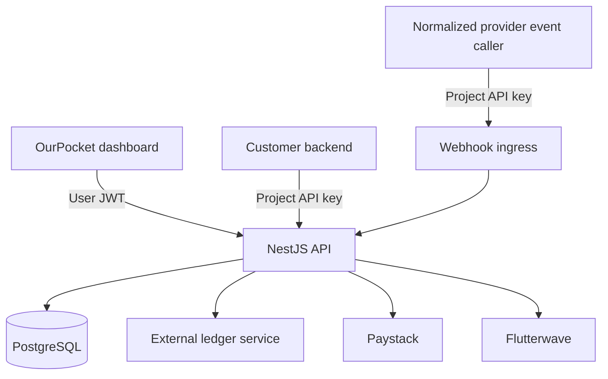

OurPocket separates account management, project configuration, wallet orchestration, provider execution, and ledger accounting into distinct boundaries.

## System components

| Component | Responsibility |
| --- | --- |
| Dashboard | Account onboarding, projects, keys, provider configuration, request consoles, metrics, and webhook registration |
| NestJS API | Authentication, validation, ownership checks, orchestration, provider calls, and response envelopes |
| PostgreSQL | Users, platform accounts, projects, project keys, provider connections, wallet identity, transactions, and webhook registrations |
| External ledger | Wallet balances and ledger postings |
| Routing engine | Selects Paystack or Flutterwave from request-supplied routing inputs |
| Provider adapters | Translate OurPocket operations into provider requests |

## Management and runtime planes

OurPocket has two authentication planes.

<CardGroup cols={2}>
  <Card title="Management plane" icon="user-shield">
    Dashboard and configuration endpoints use a user JWT. They manage platform accounts, projects, keys, providers, webhook registrations, and usage metrics.
  </Card>
  <Card title="Runtime plane" icon="key">
    Wallet, transaction, and normalized webhook ingress endpoints use a project API key. Runtime requests are isolated to the key’s project.
  </Card>
</CardGroup>

## Wallet execution

A wallet operation follows this sequence:

<Steps>
  <Step title="Authenticate the project">
    The API verifies the project key, checks quota, increments usage, and resolves the owning project.
  </Step>
  <Step title="Validate the request">
    Global request validation transforms supported values, strips unknown fields, and rejects non-whitelisted properties.
  </Step>
  <Step title="Select execution mode">
    The operation can remain ledger-only or select a provider from explicit or strategy-based request data.
  </Step>
  <Step title="Execute provider work">
    When a provider is selected, the adapter executes the provider operation before the ledger posting.
  </Step>
  <Step title="Post to the ledger">
    The API sends balance and ledger operations to the external ledger service.
  </Step>
  <Step title="Return normalized context">
    The response includes OurPocket data and, for provider-backed operations, provider and ledger results.
  </Step>
</Steps>

<Warning>
  Provider execution and ledger posting are not atomic. If a provider succeeds and the ledger fails, the repository contains no automatic compensation workflow. Integrations should retain references and reconcile ambiguous outcomes.
</Warning>

## Persistence boundary

PostgreSQL stores wallet identity, but it does not store wallet balances or ledger entries. `GET /v1/wallets/{walletId}` combines the persisted wallet with a balance fetched from the external ledger.

The external ledger implementation is not included in this repository. Its amount precision, insufficient-funds behavior, idempotency, authorization, and reconciliation guarantees must be confirmed with the deployment owner.
