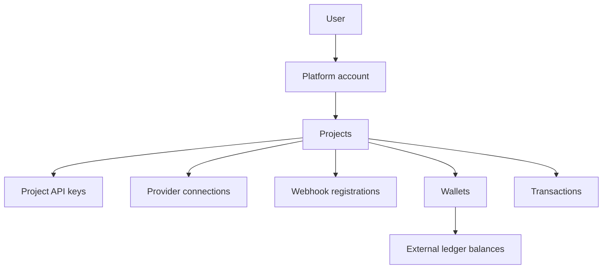

## User

A user authenticates to the management API with email and password. A signed JWT represents the authenticated session.

## Platform account

A platform account represents the user’s workspace. The dashboard creates or resolves this workspace after login. One platform account can own multiple projects.

## Project

A project is the principal isolation boundary. It owns runtime credentials and operational resources. Project names are converted into slugs, and slugs are unique within a platform account.

The selected project in the dashboard is browser-local context. Selecting a project does not alter API keys or resources in another project.

## Project API key

A project key authenticates runtime operations. Each project supports one `test` key and one `live` key at the database constraint level.

The key determines:

- Project identity
- Scope label
- Request usage count
- Quota
- Optional expiration

## Provider connection

A project provider connection stores configuration for a provider catalog entry. The connection flow encrypts configuration using AES-256-GCM before persistence and returns masked secret values to the dashboard.

<Note>
  Current wallet and transaction runtime routes primarily use credentials supplied with each request. Persisted project connections are not automatically loaded by the primary routing path.
</Note>

## Wallet

A wallet belongs to a project and has a currency. Its balance is obtained from the external ledger. Wallet creation can optionally trigger a provider adapter operation.

## Transaction

The unified transaction API stores a project-scoped transaction record with a unique reference and one of three states: `pending`, `success`, or `failed`.

Direct wallet credit, debit, and transfer endpoints do not create the same local transaction record. Use `/v1/transactions` when durable API-side status is required.

## Webhook registration

A registration stores an endpoint URL, secret, active state, and subscribed event names. Registration does not currently activate outbound delivery.
